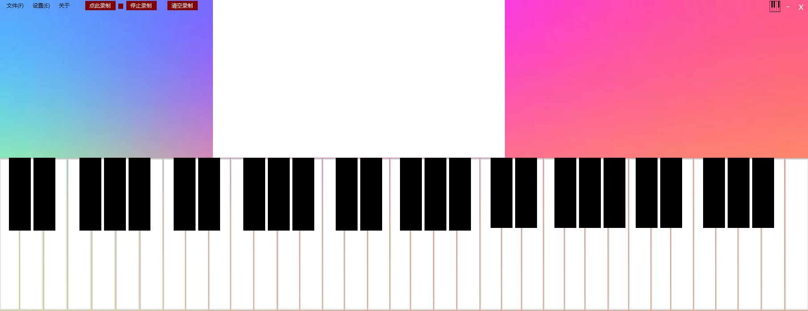
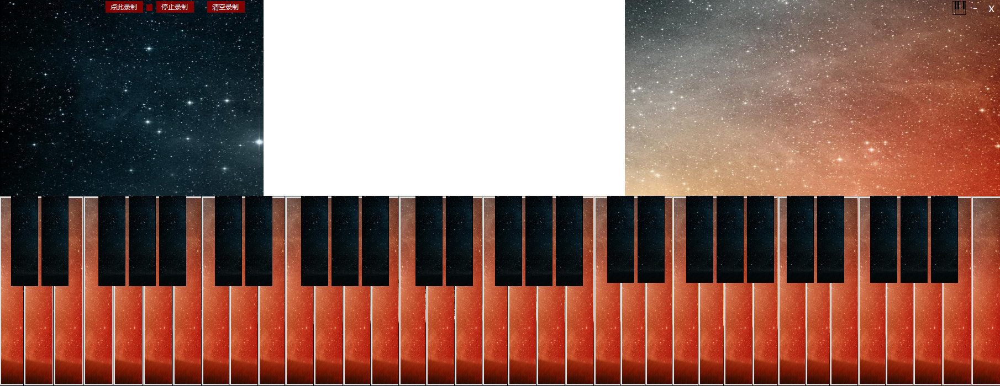
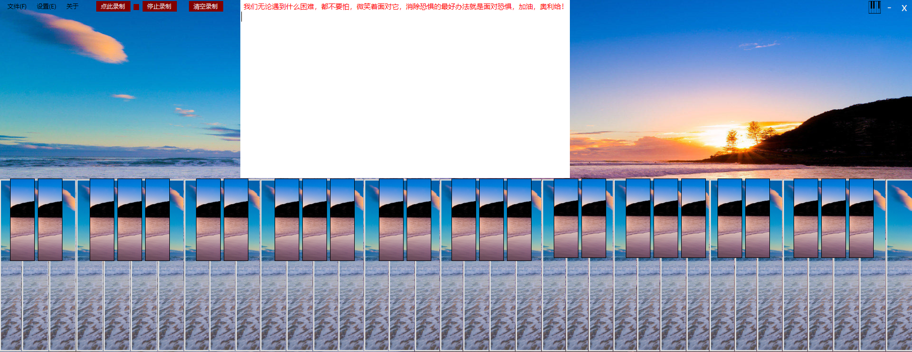

# 欢迎来到cctvadmin在Github上的博客  
  
  
  
  
你应该不会爱上这里，因为这里是空的
  
  
  
如果你不嫌麻烦，可以在[**这里**](weixin.png) 给我赞助  
  -----------------------------------------------------  
  项目经历了13天,数据丢失三次,总代码量5622,损失代码量约2000+  
  全程仅一人制作,包括:软件,前端,配置,PS,音频,脚本  
  
  
-----------------------------------------------------  
  
  **开源时间:*2020/1/16/ 8:10***
## 钢琴的项目在[**这里**](http://github.com/cctvadmin/Piano)开源  
  
  **上传时间:*2020/1/16/ 12:00***
### 下载可执行程序[.exe](http://github.com/cctvadmin/Piano/Piano.exe) Piano.exe
  
### 下载压缩包[.zip](http://github.com/cctvadmin/Piano/Piano.zip) Piano.zip 
  
  
  
**这是默认运行界面：**  
  
  
  
  
**这是自带的主题效果：**  
  
  
  
   
## 还可以自定义主题  不过我懒的加

   
  
  你可以给我致邮箱:[2075383131](https://qm.qq.com/cgi-bin/qm/qr?k=xcu0uvyYc_Rsp0zk4ZYqvKl4XyppGEyV)
  
  Github:[cctvadmin](https://github.com/cctvadmin/)
